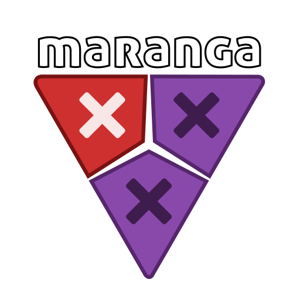

<p align="center">
  
</p>

<p align="center"><em>A word game from Creativity Hacker.</em></p>

---

## The game

You've got 100 tiles and all the time in the world. 

If you've played other anagramming games for any length of time, you've noticed how repetitive they get. After all, how many times can you type in: *eat, ate, tea, eta, tae...* before your eyes roll back in your head and you begin to hear voices telling you to hurt the people you love?

Well, Maranga is my attempt to protect your family while putting the fun back into anagramming. No more mindlessly whipping through all those tiny combinations. Instead, you'll focus on bigger, more challenging words. Forget the 3s and 4s. With Maranga, you'll soon be rocking words in the 8-, 10-, and even 12-letter territory.

The challenge is simple enough: Take a bag of 100 random letters and organize them into real words, with no tiles left over. But "simple" is not the same as "easy," and beginners will find plenty of challenge just emptying the bag, let alone worrying about high scores.

There are literally trillions of different game boards to explore, and a variety of ways to share the experience with others - both strangers online and your own friends sitting right there with you in your own living room.

There are also a few things Maranga does not do, on purpose. There are:

- No ads. No microtransactions. No charge. No hidden features. The entire game, completely free, for everyone, forever.
- No player account, no sign-in, no personal data collected.
- No internet connection required to play.
- No store account needed to get it, and no install logged to an ad profile. Works fine on de-Googled phones.

## Get it

**[Download the latest APK →](https://github.com/CreativityHacker/maranga/releases/latest/download/maranga.apk)**

Android only, for now. Your phone will ask you to confirm before it installs — that's normal for anything that doesn't come from the Play Store.

There's a friendlier version of this page, with install instructions, at **[play.creativityhacker.ca](https://play.creativityhacker.ca/downloads/maranga)**.

### Verify what you're installing

Every release is signed with the same key. Before you install, you can check that the APK you downloaded is the one I built:

```
apksigner verify --print-certs maranga.apk
```

The SHA-256 fingerprint should be:

```
debf2f9ed2a7c67d32f765528032893093e4e9b522b9d22fb55fdb1ab8e659a9
```

If it isn't, something is wrong and you should not install it.

That key never changes, which also means updates install cleanly over the top of what you already have. Your saved games survive.

### Pre-releases

Releases marked **pre-release** are untested betas, and they're here for people who've volunteered to help me break things. The download link above always resolves to the current stable build and will never hand you a test version.

## Why there's no source code here

This repository publishes builds, not code. The algorithm Maranga uses to ensure that randomly generated games are solvable is a labor of love that I'd rather not hand to clones and copycats, so the source tree stays private for now.

That means you can't read the code or build it yourself, and I realize this will be a problem for some people, which is why I'm publishing the signing fingerprint above. At least this way, you can verify that the version you're getting really came from me. 

Whether that makes it trustworthy is a decision only you can make.


## Found a bug?

Please use the bug reporting tool inside the app — it's in the main menu. That will package up the little bit of data I need to reproduce the problem and send it directly to my server - no middlemen -  which a message posted here would not do.

For that reason, issues are turned off on this repo.

## Join me in the Studio Commons

I think of Patreon as a social platform for two kinds of people: those who build stuff and those who enjoy the things they build. But everything I post there is in the free section. Strategy tips for Maranga, open challenges where people all play the same puzzle board and then discuss it. Even behind-the-scenes details about other things I'm working on. All free. 

Check it out **[on Patreon](https://patreon.com/CreativityHacker)**.

---

Maranga is free to download and play. The source is not published, and all rights are reserved.

*Made by Jefferson Smith, the Toymaster General, at [Creativity Hacker Studio](https://creativityhacker.ca).*
